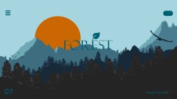

# Morph Presentations — Teardown & Build Guide

**Scope:** How to build PowerPoint "morph" presentations in the style of **hmpt** (the TikTok designer whose free templates Ant studied). Reverse-engineered from `reference/forest-hmpt.pptx`.
**Audience:** Anyone on the team building a slick animated deck (pitch decks, Example/OpenClaw decks, content).
**Method:** Written from the actual `.pptx` XML — every number below is extracted from the source file, not guessed.



> **▶ Start here to build a deck:** [`deck-brief-protocol.md`](deck-brief-protocol.md) — the standard brief/direction intake (theme, brand, content, visuals) so every deck is intentional, not improvised.

> **▶ Working demo:** [`demo/index.html`](demo/index.html) — a self-contained, responsive web deck (OpenClaw, re-skinned to our dark-terminal house style) that reproduces the morph mechanic with the **View Transitions API**. Open it in a browser; arrows / swipe / click to advance, or tap a section. Drop it on any static host (e.g. GitHub Pages) to share a link. See §8.

---

## 1. What we studied

| Field | Value |
|---|---|
| File | `forest PPT 1.pptx` ("FOREST", design by hmpt, 2022) |
| Saved to | `reference/forest-hmpt.pptx` (clean re-pack of the original) |
| Slides | 8 (cover + agenda + 6 content) |
| Canvas | 16:9 widescreen — `12192000 × 6858000` EMU (13.33" × 7.5") |
| Transition | `<p159:morph option="byObject"/>` — **Morph**, `spd="slow"`, `dur=2000ms`, auto-advance `advTm=1000ms` |
| Fonts | Heading **Calibri Light**, body **Calibri** (swap for something with more character — see §6) |
| Imagery | **Zero photos.** Entire look is native vector shapes + 5 embedded SVG icons |
| Palette | The "Bay of Bengal" 9-stop scheme (below) |

### The palette (copy these hex values straight in)
```
005F73  deep teal      (darkest mountains, primary text)
0A9396  teal           (mid mountains)
94D2BD  mint           (sky / light panels)
E9D8A6  sand           (light accent / paper)
EE9B00  amber           (the sun, primary highlight)
CA6702  pumpkin        (sun shadow / warm accent)
BB3E03  burnt orange
AE2012  rust
9B2226  oxblood        (deepest warm)
```
A cool→warm gradient: cool teals build the landscape, one warm amber pops as the focal point (the sun). **One warm accent against a cool field** is the whole reason the cover reads instantly.

---

## 2. The morph mechanic (this is the entire trick)

Morph is **not** a transition you sprinkle on. It's a layout discipline. PowerPoint's `morph option="byObject"` tweens between two slides by **matching objects with the same name** and animating position / size / rotation / color from slide N to slide N+1. Objects that exist on both slides glide; objects that only exist on one fade in/out.

So a good morph deck is built on two object classes:

**A. Pinned anchors — identical name + identical geometry on every slide.**
Measured from the FOREST deck, the bottom navigation row does *not* move at all between content slides:

| Element | x, y (inches) | Behaviour |
|---|---|---|
| `fruits` / `baru` | 1.07, 5.43 | dx=0, dy=0 across slides |
| `seed` / `soya` | 4.25, 5.40 | dx=0, dy=0 |
| `tree` / `lama` | 7.19, 5.41 | dx=0, dy=0 |
| `bunga` / `rapper` | 9.84, 5.48 | dx=0, dy=0 |
| `07` page number, `design by hmpt`, hamburger menu icon | corners | dx=0, dy=0 |

Because these are byte-for-byte identical, morph renders them **perfectly still** — the frame feels rock-solid while everything inside it moves. That stillness is what makes the motion look designed instead of chaotic.

**B. One travelling hero — same name, *different* geometry per slide.**
The section word + its leaf/tree/seed icon is huge and centered on the cover, then shrinks and travels to its slot in the bottom nav on the content slide. The headline block (`about seed` → `about fruits` → …) lives in the same screen region but swaps text. That single dramatic move — big-center → small-corner — is the signature "hmpt zoom".

> **Rule of thumb:** ~80% of objects pinned and identical, ~20% travelling. If everything moves, it reads as noise.

### The exact transition XML (paste-ready)
On every slide except the first, inside `<p:sld>`:
```xml
<p:transition xmlns:p14="http://schemas.microsoft.com/office/powerpoint/2010/main"
              spd="slow" p14:dur="2000" advTm="1000">
  <p159:morph option="byObject"/>
</p:transition>
```
`option` can be `byObject` (match by shape, used here), `byWord`, or `byChar` (letter-level text morph). In the PowerPoint UI this is just: **Transitions → Morph → Effect Options → Objects**, duration 2.0s.

---

## 3. Construction lessons (why it looks expensive)

1. **All-vector, no stock photos.** The cover landscape is layered shapes: `rect`/freeform mountain silhouettes (×19), `roundRect` panels & nav pills (×13), one `ellipse` sun, 5 SVG icons. No photo means no resolution/lighting mismatch — everything shares the palette, so it's automatically cohesive. *This is the single biggest reason it looks premium.*
2. **Silhouette layering for depth.** Mountains are 3–4 overlapping shapes in descending teal values (`94D2BD` back → `0A9396` mid → `005F73` front). Same shape language, just stacked and recolored = instant depth, and it morphs beautifully because each layer is its own named object.
3. **Rounded-rectangle "pills" as the UI motif.** Nav chips, the top-right button, content cards are all `roundRect`. Consistent corner radius is the through-line that ties cover → content together.
4. **A persistent menu = built-in wayfinding.** The 4-item bottom nav (each a primary label + smaller secondary label stacked) tells the viewer where they are in the deck the whole time. It also *gives morph something stable to anchor on*.
5. **Big numerals as decoration.** The oversized `07` in the corner is structure-as-ornament — cheap, bold, and a great morph target (it can re-scale between sections).
6. **Generous negative space + one focal point per slide.** Cover = sun behind wordmark. Content = one headline + one body block. Never two competing focal points.

---

## 4. Reusable skeleton (steal this layout)

```
┌────────────────────────────────────────────┐
│ ☰ menu                          ( pill btn )│  ← pinned anchors (top corners)
│                                             │
│        [ HERO: section word + icon ]        │  ← travelling hero (center→corner)
│        [ headline:  about <topic> ]         │  ← region-stable, text swaps
│        [ body copy block ]                  │  ← fades per slide
│                                             │
│ 07                            design by you │  ← pinned anchors (bottom corners)
│ ┌fruits┐ ┌seed┐ ┌tree┐ ┌bunga┐             │  ← pinned nav row (NEVER moves)
└────────────────────────────────────────────┘
```

---

## 5. Step-by-step build recipe (PowerPoint / Google Slides / Canva)

1. **Set 16:9** and drop in the 9-color palette as theme colors.
2. **Build ONE master content slide:** top menu icon + pill, bottom `07` + credit + the 4 pinned nav chips, a center hero word, a headline, a body block.
3. **Name your objects** (Selection Pane → rename). Morph matches by name, so the hero word must carry the *same name* on every slide it travels through. (PowerPoint also auto-matches duplicated objects, but explicit names like `nav-seed`, `hero-word` make it reliable.)
4. **Duplicate the slide** for each section. On each copy: change only the headline text, the body, and **move/scale the hero** into its new spot. Leave the pinned anchors untouched.
5. **Cover slide:** same elements but hero word huge & centered, landscape built up behind it. Sun = `ellipse` in `EE9B00`; mountains = 3 stacked freeform shapes in descending teals.
6. **Apply Morph** to every slide after the first (§2 XML, or Transitions→Morph, 2.0s). Optionally set auto-advance ~1s for a self-running reel (great for TikTok/Reels export).
7. **Export:** PowerPoint → "Create a Video" (1080×1920 for vertical social, or 16:9) renders the morph as actual motion video.

---

## 6. How to make it *ours* (not a clone)

- **Swap the fonts.** Calibri is the one cheap tell. Use a display face with character (e.g. a strong geometric or editorial serif for the hero, a clean grotesk for body). Per `ClaudeCode/CLAUDE.md` design rules, for *product UI* we use mono — but decks can break that; pick per-deck.
- **Re-skin the palette per project.** Keep the *structure* (cool field + one warm pop); change the hues. Example could run a brand palette through the same cool→warm logic.
- **Keep the mechanic, change the metaphor.** "FOREST / mountains" → could be "data layers", "product tiers", "roadmap horizon" — any subject that justifies stacked silhouettes and a travelling hero.

---

## 7. Tooling notes

- The reference `.pptx` is all-vector and tiny (~85 KB) — open it in PowerPoint/Keynote/Google Slides to scrub the morph live.
- **Programmatic generation** (if we want to script decks): `python-pptx` can build shapes/text but **cannot** write the morph transition — it's an unsupported namespace, so you'd post-process the slide XML to inject the `<p:transition>` block from §2. A Canva MCP connection is also available in this workspace for AI-assisted deck generation if we'd rather not hand-build.
- LibreOffice headless was not able to render this file in the build sandbox (env limitation), so visual study here used the deck's embedded title thumbnail (above) + direct XML extraction.

---

---

## 8. The web build (`demo/`) — morph without PowerPoint

`demo/index.html` is the original single-file proof. It's since been productionized into a small multi-deck site with a shared engine at [`/decks/`](../../../decks/) (landing + **Example** demo + **Métis framework** deck) — that's the one to host. The notes below apply to both.

`demo/index.html` is the first real deck, built as an **interactive website** instead of a `.pptx`. One link, works on mobile and desktop, no app to install — and the morph maps almost 1:1 to the web:

| hmpt / PowerPoint | This web deck |
|---|---|
| `morph option="byObject"` (match by name) | `view-transition-name` on shared elements |
| Pinned anchors (nav row, `07`, credit) | Elements with **no** transition-name → held still by the root snapshot |
| Travelling hero (big-center → small-corner) | `#hero` with `view-transition-name:hero`, repositioned via a `.cover`/`.content` class swap inside `document.startViewTransition()` |
| Moving active-section highlight | `.nav-bar` (`view-transition-name:navbar`) whose `left`/`width` are set to the active item |
| Layered silhouette landscape | CSS `clip-path` ridges + a blurred gradient `orb` (`view-transition-name:orb`) for parallax |
| Calibri (the "cheap tell") | **JetBrains Mono** + house indigo/terminal palette per `docs/design-guidelines.md` |

**How it works:** changing a slide updates the DOM inside `document.startViewTransition(() => render())`. The browser snapshots before/after, then tweens every shared `view-transition-name` between its two bounding boxes — exactly the "pinned anchors + one travelling hero" discipline from §2, just expressed in CSS. Falls back to instant cut where View Transitions aren't supported (older Firefox), so it's never broken — only less animated.

**To make it a deck of your own:** edit the `NAV` and `SLIDES` arrays at the bottom of the file (hero word, headline, body, orb position). No build step.

**To share:** it's a single static file — host on GitHub Pages, Netlify drop, or just send the file. (Our Pages repo is `anthonyabusa.github.io`, a separate repo; copying it there is the hosting follow-up.)

---

*Source file owned by Ant (Google Drive). Reference copy committed for study only.*
